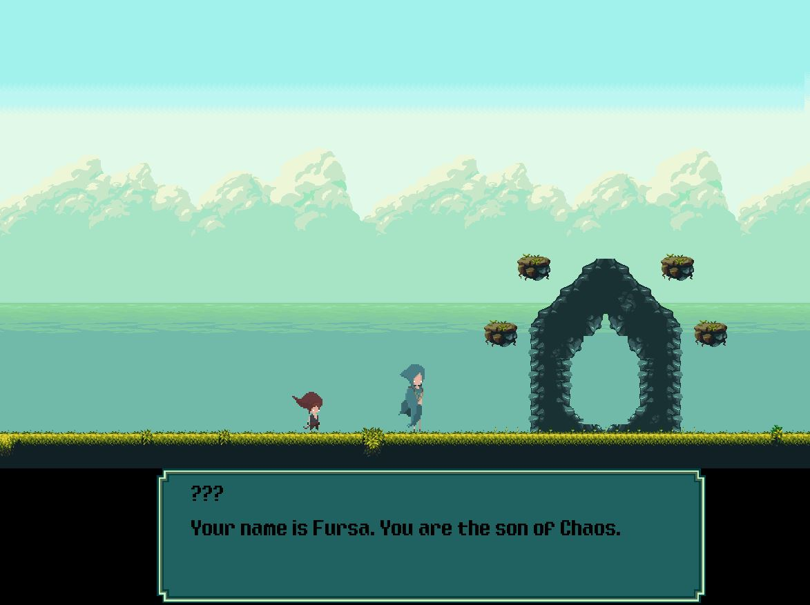
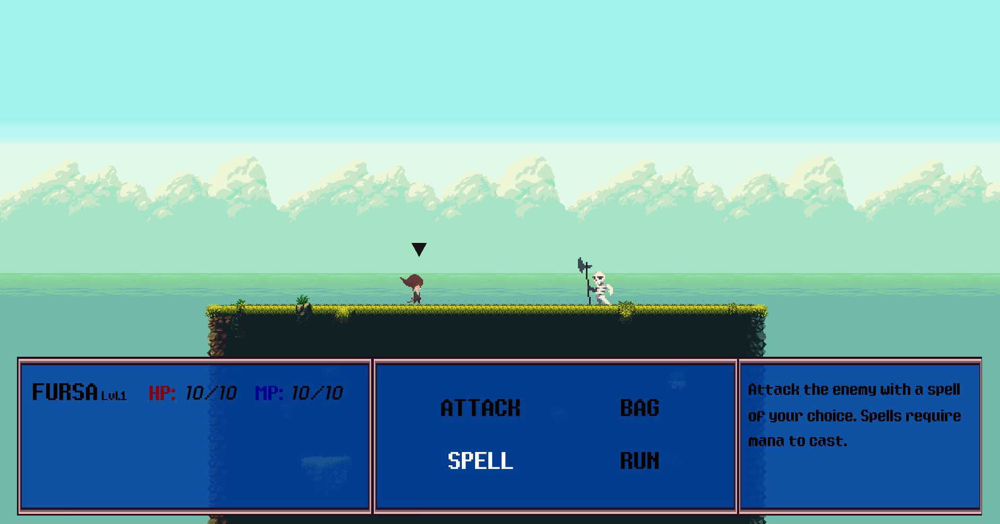

# Kismet
### Turn-based combat, 2D side-scrolling platformer videogame coded entirely in python

A project that I work on in my free time. I hope to some day to finish the game and publish it to Steam.
 Currently on hold as I attend graduate studies.
 
### !!! - It should be noted that some areas of the code require major refactoring.
***
### Dialogue Cutscene

***
### Turn-Based Combat with Skeleton Enemy

***
**Warning: The .exe file is often not updated. The .exe file is just a way for me to test whether or not the code is compatible on other Windows platforms. Better to run the Kismet.py while project is in progress.**
